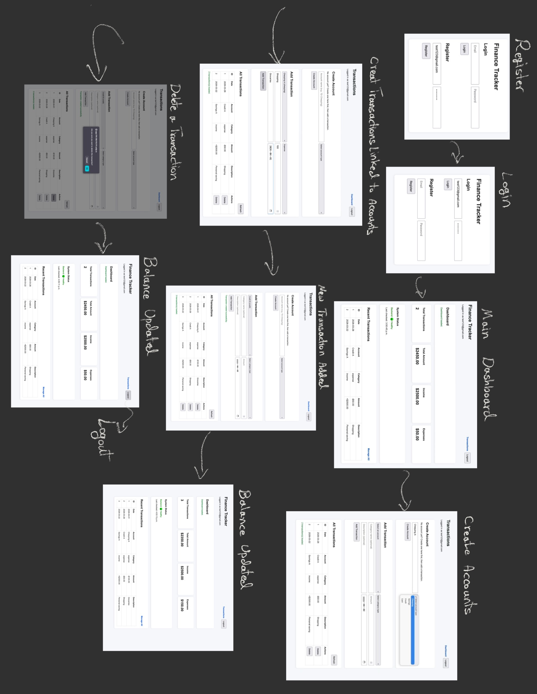

# Finance Tracker
Finance Tracker is a cloud-based personal finance application designed to help individuals better oversee their finances. It targets users seeking a centralized, accessible view of their accounts, transactions, and balances. The system enables users to record and manage income and expenses while monitoring balances in real time. The application consists of three containerized services orchestrated by Kubernetes and deployed on DigitalOcean. Transaction data is stored in a PostgreSQL database with persistent block storage to ensure durability, while replicated backend services enhance availability. Prometheus, Grafana, alerts, and health endpoints enable monitoring system performance and resource usage.

---

### Team Members
Romina Bahrami  
Mohammad Araf Harun  
Brendan Hu  
Mingfei Li

---
 
### Motivation
Most people lack a simple, reliable way to track and plan their finances due to fragmented tools and costly solutions. This project aims to provide an accessible, cloud-based system that centralizes financial data while ensuring reliability and persistence.

---

### Objectives
The goal of this project is to build a durable cloud-based finance tracker that enables users to securely record transactions, monitor budgets, and access real-time financial information from anywhere.

---

### Technical Stack
The application consists of three containerized services orchestrated by Kubernetes and deployed on DigitalOcean, which is explained below in more detail.

There is a Python/Flask backend with Flask-SQLAlchemy and Flask-Migrate for the data layer, a static/HTML + JavaScript frontend served from its own container (Nginx-style static hosting in the frontend image), and PostgreSQL 17 for relational storage. The API exposes REST JSON endpoints, uses Flask-JWT-Extended for authenticated access, Argon2 for password hashing, and Flask-SocketIO for real-time push updates. For monitoring, Prometheus collects metrics from nodes/pods/endpoints, and Grafana displays them in live dashboards. In addition, `/health` endpoints, logs, and DigitalOcean's alerting system provide extra levels of observability.

Orchestration is done by Kubernetes. Manifests under `k8s/` define Deployments and Services for the API and frontend, a StatefulSet and Service for Postgres, PersistentVolumeClaims backed by DigitalOcean block storage (do-block-storage) for the database (and for Prometheus TSDB), and an Ingress (nginx class) for HTTP routing. Local development uses Docker Compose to run the same logical services (API + Postgres + frontend) with a named volume for Postgres data.

The deployment is on DigitalOcean; DOKS for the cluster, DigitalOcean Container Registry for images, and DigitalOcean Spaces (S3-compatible) for off-cluster database backups. GitHub Actions automates building and pushing images and rolling out new versions with kubectl. 

#### Repository Structure

- `app/`: Backend API service and [`app/Dockerfile`](app/Dockerfile). See [`app/README.md`](app/README.md).
- `docker-compose.yml`: Local stack (API, Postgres, frontend); run from the repository root.
- `frontend/`: Frontend web application source and usage details. See [`frontend/README.md`](frontend/README.md).
- `k8s/`: Kubernetes manifests and deployment/operations guidance. See [`k8s/README.md`](k8s/README.md).
- `backup-restore/`: Backup and restore workflows and scripts. See [`backup-restore/README.md`](backup-restore/README.md).

---

### Features
The application lets users register and log in, then manage accounts, and transactions (create, read, update, delete) so they can track income and expenses and see balances and activity in one place. The dashboard and transaction views update in real time across tabs when data changes, using WebSockets, which supports our objective of timely, accessible financial visibility.These features connect to the course requirements as follows.
#### Core Features
The full stack is **containerized** with **Docker** and supports **local development via Docker Compose**. PostgreSQL uses **persistent storage** in every environment to ensure data durability across restarts. In local development, this is provided by **Docker volumes**; in Kubernetes, it is provided by **Persistent Volume Claims (PVCs) backed by DigitalOcean Block Storage**.

**Deployment provider** is **DigitalOcean**, which provides Kubernetes cluster, registry, block storage, Spaces.

**Orchestration** is done by **Kubernetes** with Deployments, Services, Ingress, and PVCs for stateful Postgres; the backend runs with multiple replicas behind a Service for basic high availability and load distribution (fixed replica count). 

The **monitoring and observability** requirements are satisfied through both DigitalOcean provider monitoring and an internal Prometheus + Grafana monitoring stack deployed in Kubernetes. DigitalOcean monitoring is configured to send email alerts when key infrastructure thresholds are exceeded, including CPU usage, memory usage, public inbound bandwidth, and disk utilization across droplets. Within Kubernetes, Prometheus collects metrics from the Flask backend, containers, nodes, and persistent volumes, while Grafana provides dashboards for CPU, memory, network activity, database storage usage, and HTTP request rate from the backend `/metrics` endpoint. The application also includes health-check endpoints (`/health` and `/health/db`) to verify application and database availability, along with backend logging via Python’s logging module. On the frontend, a system status card on the main dashboard continuously checks backend health and updates automatically in real time.
Together, these features provide alerting, health checks, logging, dashboards, and user-facing real-time system visibility for the deployed system.

#### Advanced Features
Several advanced features are implemented to enhance functionality, reliability, and security.

**Real-time functionality** is achieved using Flask-SocketIO and a Socket.IO client, where the backend emits data_updated events on transaction creation or deletion, allowing all connected clients to automatically refresh without manual reload. 
A **CI/CD pipeline** is implemented using GitHub Actions, which automates Docker image building, pushing to a registry, and rolling out updates to Kubernetes deployments. 
For **backup and recovery**, a scheduled Kubernetes CronJob performs automated database backups to DigitalOcean Spaces, with restoration supported through a dedicated Kubernetes Job. 
Additionally, the system includes **security enhancements**, such as JWT-based authentication, Argon2 password hashing for secure credential storage, and Kubernetes Secrets for managing sensitive configuration data. Together, these features demonstrate real-time interactivity, automated deployment, data durability, and secure system design.

---

### User Guide 
The diagram below demonstrates how to use different features of the app.

---

### Development Guide
#### Local development (Docker Compose)
Docker Compose builds and starts the API, Postgres, and frontend together with `localhost` URLs.

##### Prerequisites

- Docker Desktop

##### Quick start

1. Create your local env file by copying [`.env.example`](.env.example) at the **repository root** and rename it to `.env`.
2. Fill in values in `.env`.
3. From the **repository root**, start everything:

   - `docker compose up --build`

   Compose uses [`docker-compose.yml`](docker-compose.yml) at the repo root; the API image is built with [`app/Dockerfile`](app/Dockerfile) and context `.` so `requirements.txt`, `run.py`, `entrypoint.sh`, and `migrations/` resolve correctly. Compose loads `.env` from the root for `${DB_USER}` and similar substitution.

   To build only the API image manually:

   - `docker build -f app/Dockerfile -t finance-tracker-api .`

##### Service URLs

- Frontend: `http://localhost:3000`
- Backend API: `http://localhost:5001`
- Postgres: `localhost:5432`
- Prometheus: `http://localhost:9090`
- Grafana: `http://localhost:3005`

##### Shutting down

From the **repository root**:

- Stop containers: `docker compose down`
- Stop and remove DB data volume: `docker compose down -v`

### Deployment on DigitalOcean (Kubernetes)

Production-style deployment is on a **DigitalOcean Kubernetes (DOKS)** cluster using the manifests under `k8s/`. Images are pulled from **DigitalOcean Container Registry**, the database and volumes use **DO block storage**, and traffic is exposed via **Ingress** (and monitoring stacks like Prometheus/Grafana). `kubectl` and `doctl` will be used against the cluster rather than `docker compose`.

For prerequisites, apply order, and operations, see [`k8s/README.md`](k8s/README.md).

---

### Deployment Information: 
Live URL of the application: ~~http://app.174.138.113.111.sslip.io~~ (deprecated)

---

### AI Assistance & Verification (Summary)
AI tools were used as a **supporting aid** throughout development, primarily for:
- Exploring architecture decisions (Docker/Kubernetes setup)
- Generating and refining YAML configurations (K8s, CI/CD workflows)
- Debugging deployment and configuration issues
- Polishing code and improving documentation clarity

The team critically evaluated AI suggestions rather than applying them directly. For example, in one case, in the CI/CD pipeline, AI helped diagnose a GitHub Actions deployment issue related to missing `doctl` authentication for DigitalOcean Kubernetes access. In another instance, AI was used as a starting point to learn how to create DB replicas. In both situations, the team verified the solutions through testing.

All AI-generated suggestions were validated through:
- Local testing before merging to main
- Observing logs, metrics, and deployment behavior in Kubernetes
- Inspecting DigitalOcean services (registry, alerts, deployments)
- Cross-referencing with official documentation (DigitalOcean, Docker, Kubernetes)

Concrete examples of AI interactions, including prompts, responses, and evaluation, are documented in **ai-session.md**.

---

### Individual Contributions

Romina Bahrami: Backend + Authentication & Security + Monitoring & Observability + CI/CD Pipeline  
Mohammad Harun: Initial Project setup + Database & Data Durability + Backup & Recovery  
Brendan Hu: DevOps & Cloud (Docker, Kubernetes, DO)  
Bobby Li: Frontend & UX + Real-time Functionality  

---

### Lessons Learned and Concluding Remarks
Developing the Finance Tracker was a valuable experience, showing how a simple app idea can grow into a more complete cloud-based system. One of the biggest lessons learned was that building features is only one part of the work; just as much effort goes into making the system reliable, secure, observable, and maintainable once it is deployed. Working with Kubernetes, persistent storage, monitoring tools, and CI/CD showed how many moving parts are involved in building and running a realistic application.

A particularly important takeaway was how challenging and sensitive it can be to design different elements to maintain compatibility. Defining data policies, handling schema changes and migrations, and ensuring the API, backend logic, and frontend functionality stay consistent with those decisions required careful planning. Even small changes to financial data handling can have a big impact on correctness and long-term maintainability.

The project also reinforced the importance of teamwork and coordination. Because the system involved multiple components, clear communication, advanced planning, and shared understanding were essential to keep everything working together. Overall, this project was a strong learning experience in combining software development, cloud deployment, and collaboration into one cohesive system.

---

### Demo
The video demo can be accessed via [this link](https://drive.google.com/file/d/1VRBkofOjCuChnc7TgpzbVq7if0Xc7yxS/view?usp=sharing).

---

